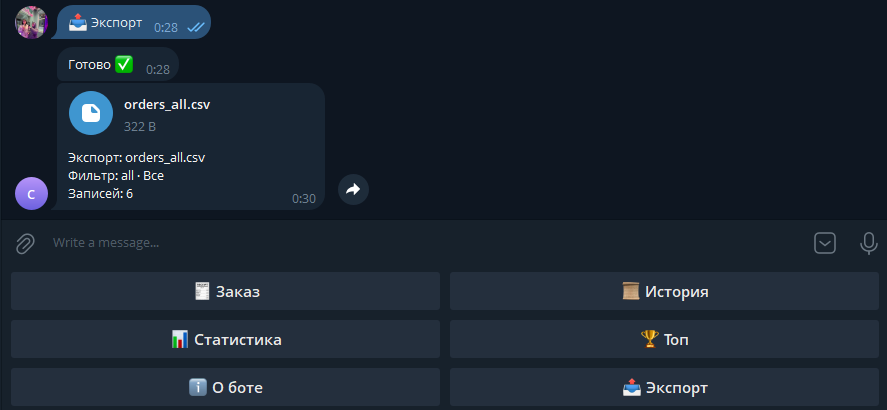
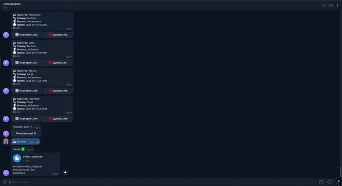

# Coffee Shop Bot — приём заказов в Telegram за 1–2 дня

Готовый телеграм-бот на **Aiogram 3** для локального бизнеса: меню → заказ → история/повторы → экспорт CSV → статистика и топ. Идеально для кофейн, салонов, мастерских, локальных доставок.

[](https://t.me/yaroksirok) 
[💸 Цены и опции](docs/pricing.md) 
[🛠 Установка](docs/install.md) 
[👀 Обзор с картинками](docs/overview.md)

---

## ✨ Что умеет
- Пошаговый заказ (FSM): напиток → размер → молоко → подтверждение.
- История с пагинацией и фильтром по напитку, **Удалить** + **Undo**, **Повторить**.
- **Экспорт CSV**: сегодня / неделя / месяц / всё и **по напиткам**.
- **Статистика** (сегодня/всё) и **🏆 Топ** с мини-кнопками смены периода.
- `/health` — версия, аптайм, путь к БД, «пинг» БД, счётчики.
- Настройки через `.env`, логирование, список админов.

## 🧪 Скриншоты
(ещё в `docs/overview.md`)




<p align="center">
  
</p>


## 🧰 Команды бота
`/order`, `/history`, `/stats`, `/top`, `/export`, `/health`

## 🧩 Технологии
- Python 3.11+, **Aiogram 3.x**, **aiosqlite**
- Деплой без сервера: **Railway** / Render
- SQLite по умолчанию (можно сменить на Postgres)

## ⚙️ Быстрый старт локально
```bash
python -m venv .venv
# Windows: .venv\Scripts\activate
# macOS/Linux: source .venv/bin/activate
pip install -r requirements.txt

cp bot/.env.example bot/.env
# Вставь BOT_TOKEN от BotFather в bot/.env
python -m bot.main
