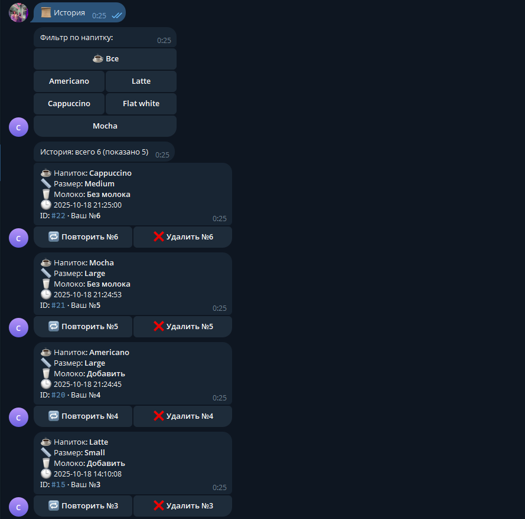
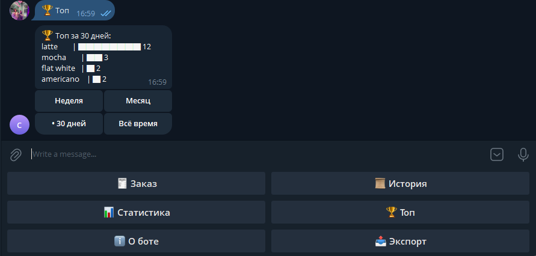
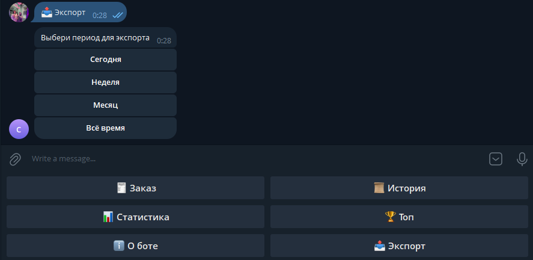
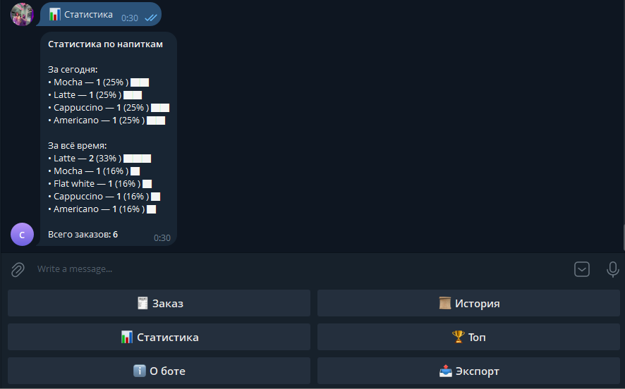
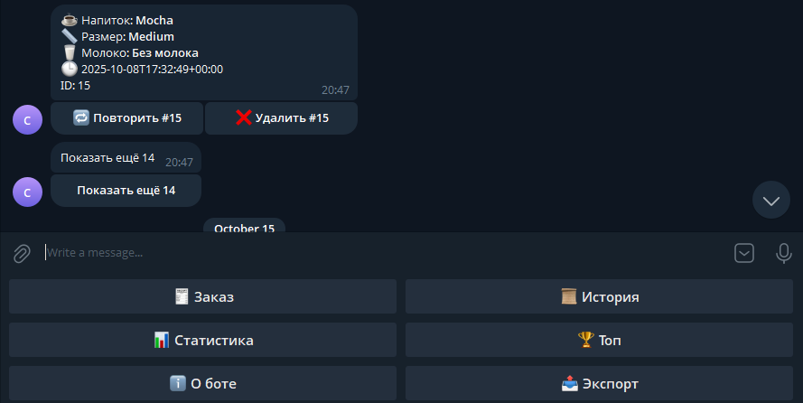
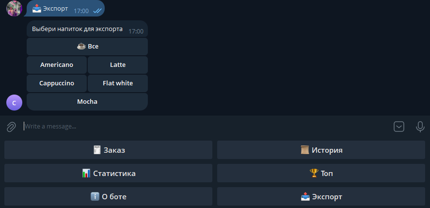

# Кейсы

## Кофейня на районе (самозанятый)
**Задача:** быстро принимать заказы без витрины и CRM.  
**Решение:** Telegram-бот: меню → заказ → история/экспорт. Настроили экспорт в Excel и /top.  
**Результат:** +20% повторных заказов за 2 недели.

 
 

---

## Доставка десертов (малый бизнес)
**Задача:** собирать заявки и считать популярные позиции.  
**Решение:** добавили фильтр по товару и выгрузку CSV «по позиции».  
**Результат:** оптимизация закупок, сократили списания.

 
